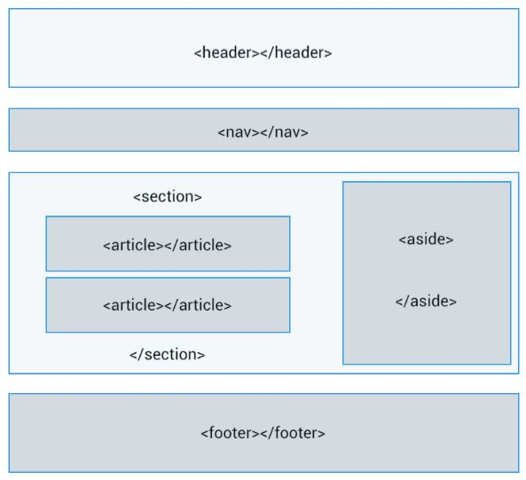

# Estructura HTML5
## Estructura básica de una página en HTML5

En HTML la estructura interna básica de una página web se ha simplificado, reduciendo el código innecesario hasta quedarse con el esqueleto básico, que sería el siguiente:

```
 <!doctype html>
 <html>
 <head>
   <head>
      <meta charset="utf-8"/>
      <title>Título de la web</title>    
   </head>
  <body>
   <body>
      Contenido de la web
   </body>
  
 </html>

```

Cada fichero HTML siempre está compuesto de dos partes: el [``<head>``](#punto2) y el [``<body>``](#punto_body)

## ¿Qué es y qué contiene el ``<head>``?


El ``<head>`` es una parte de la web donde colocamos todas aquellas etiquetas (que no se van a visualizar), pero que sirven para indicar todas las características que el navegador necesita, como por ejemplo:

La etiqueta charset es una de las impriscindibles, ya que indica la codificación que tendrá la página. Con un valor de utf-8 se mostrarán símbolos como la "ñ", "ç" o los acentos correctamente.

```
<title>Título de la página</title>
```


El texto indicado dentro de la etiqueta ``<title>`` se mostrará en la pestaña del navegador. Además ser el que se muestre en las búsquedas de los diferentes buscadores y es un elemento importante (a nivel de SEO) para el posicionamiento de la página.

```
<meta name="description" content="Descripción de la página"/>

```


Dentro del atributo content=" " escribiremos el texto que queremos que aparezca como descripcion de nuestra página cuando ésta aparezca dentro de los resultados de búsqueda de los buscadores. No influye en el posicionamiento, pero si puede condicionar a que los usuarios hagan clic y accedan en un mayor número a nuestra página.

La longitud idónea no debe ser superior a 156 carácteres, para que el buscador no lo corte por donde más le convenga.

```
<style type="text/css">
    /* código CSS */
</style>

```


Dentro de estas etiquetas style ubicaremos el código CSS que **única** y **exclusivamente** afectará a los elementos de este mismo fichero HTML.

```
<link rel=stylesheet href="css/estilo.css" type="text/css"/>

```
En el atributo href=" " indicaremos la ruta donde está ubicado al fichero CSS externo (código que afectará a todos los elementos de todas las páginas HTML donde se coloque esta etiqueta).

En el caso de que una página tenga estas dos últimas etiquetas se ejecutarán las dos. Si tienen las mismas propiedades, tendrá más valor la que se indique en último lugar.

```
<script type="text/javascript">
    // código de javaScript
</script>

```
Dentro de esta etiqueta script escribiremos el código de javaScript (en el caso de que exista) que **única** y **exclusivamente** afectará y se ejecutará dentro este mismo fichero HTML.

```
<meta name="viewport" content="width=device-width, initial-scale=1.0">	

```

El valor viewport únicamente será leído por móviles, tablets y dispositivos conectados a internet en general, en los que el tamaño de su navegador esté supeditado al tamaño de la pantalla del dispositivo (osea todos).

En este ejemplo se indica que el ancho del contenido se adaptará al ancho de la pantalla del dispositivo y que el zoom (tamaño) inicial del contenido será del 100% (para que el contenido no tenga que ampliarse por el usuario nada más acceder a la web y sea legible sin esfuerzo).

## ¿Qué es y qué contiene el ``<body>``?

El ``<body>`` es donde se colocan todos los elementos que sí se van a mostrar y que forman el contenido de la página. Habitualmente todo este contenido deberá estar dentro de cajas.


Con la versión anterior de HTML sólo existía un tipo de caja ``<div>``, por lo que una caja podía contener cualquier tipo de contenido.

Una de las novedades de HTML5, aparte de disponer de esta misma caja genérica ``<div>``, tenemos diferentes tipos de cajas destinadas cada una a un tipo de contenido concreto ``<main>``, ``<header>``, ``<nav>``, ``<section>``, ``<article>``, ``<aside>`` y ``<footer>``. De esta manera el navegador puede entender qué contiene cada una de estas cajas, sin necesidad de tener que entender el idioma utilizado y sin tener que leer ni analizar el texto que contiene.

### ``<div>`` (Caja genérica)

``<div>`` es el tipo de caja genérica, que aunque no identifica qué tipo de contenido contiene, sigue siendo la más utilizada. No obstante suele estar ubicada dentro de cajas que sí tienen un significado semántico concreto como las que siguen...


### ``<main>`` (Contenido principal de la página)

``<main>`` es la caja que contiene todo el contenido principal de la página, con las siguientes características:

*   Sólo puede existir un único ``<main>`` por página.
*   No puede estar dentro de ninguna otra caja.
*   Dentro contendrá aquel contenido que no se repita en cada página (conteniendo ``<div>``, ``<section>``, ``<article>`` o incluso ``<aside>``), pero nunca cajas como ``<header>``, ``<nav>`` o ``<footer>``).


### ``<header>`` (Encabezado)

Dentro de la caja ``<header>`` ubicamos el contenido que estaría destinado al encabezado de la página. Normalmente contiene el logo y el nombre de la página y suele estar ubicado al inicio.


###  ``<footer>`` (Pie de página)

La caja ``<footer>`` contiene la información que figura al pie de la página (normalmente es la última caja de todas) y es donde se ubica el ©, e información como el mapa de la página, autor, fecha y otros datos finales.

Actualmente existe la tendencia de hacer ``<footer>`` enormes donde figura todo lo que se puede encontrar en el sitio.

La caja ``<nav>`` contiene todos los enlaces de la página, ya sea a otras secciones de nuestro mismo sitio web o a páginas externas. Por ello, en algunos casos pueden existir varios ``<nav>``, como por ejemplo el del principio de la página y otro final ubicado dentro del ``<footer>``.

### ``<section>`` (Sección de información)

Las cajas ``<section>`` contienen el contenido genérico de la página.

*   Se pueden utilizar varios ``<section>`` al mismo tiempo en la misma página.
*   Pueden contener múltiples ``<div>`` y otras cajas relacionadas, como ``<article>``.
*   Normalmente se utilizan para grandes cantidades o secciones de información de tipo similar.

### ``<article>`` (Artículo)

Las cajas ``<article>`` también están destinadas a contener el contenido de la página, aunque normalmente suelen utilizarse para mostrar información más reducida y concreta y que puede ser independiente del resto.

### ``<aside>`` (Contenido)

Dentro de las cajas de tipo ``<aside>`` se ubican los contenidos que no tienen relación directa con el contenido, como por ejemplo información sobre vacunas o pasaportes en una web de viajes, calendario de eventos de una entidad, publicidad o la biografía del autor de un blog.


### ``<figure>`` (Imagen)

Aunque ``<figure>`` no tiene las mismas funcionalidades ni características que el resto de cajas, tiene como objetivo contener imágenes que opcionalmente pueden tener vinculadas un pie de imágen.





## Ejemplo de una estructura HTML5 más compleja

Una estructura HTML5 con todo lo explicado hasta el momento sería la siguiente:

```
 <!doctype html>
 <html>

   <head>
      <meta charset="utf-8"/>
      <meta name="description" content="Resumen del contenido de la página">   
      <title>Título de la página</title>
      <link rel="stylesheet" href="css/estilo.css" type="text/css"/>
      <style type="text/css">
      	  código CSS 
      	  código CSS 
      </style>
      <script type="text/javascript">
      	  código javaScript 
      	  código javaScript 
      </script>
      <script type="text/javascript" src="js/codigo.js"></script>
      <meta name="viewport" content="width=device-width, initial-scale=1.0">
   </head>

   <body>
   	<header>cabecera</header>
   	<nav>
   	    enlace1
   	    enlace2
   	</nav>
   	<main>
   	   <section>
   	  	<article> contenido </article>
   	  	<article> contenido </article>
   	   </section>
   	</main>
   	<footer> © pie de la página </footer>
   </body>

 </html>

```
### ¡OJO!

Las etiquetas `<body>` `<h1>` y `<main>` solo se pueden utilizar una vez por documento HTML, el resto de etiquetas de contenido se pueden usar siempre que sea necesario.